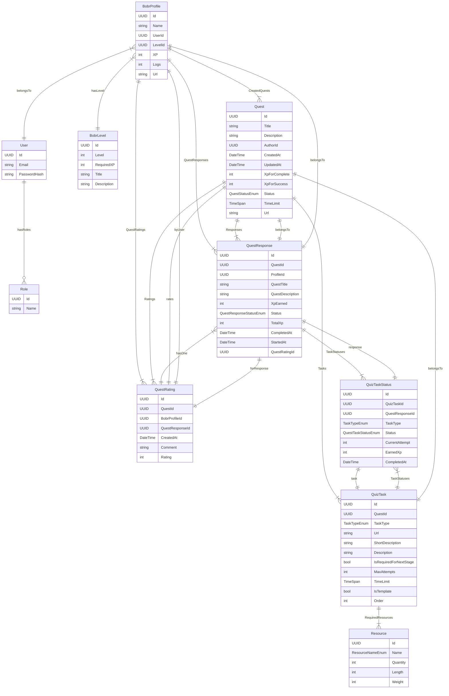

# INT20H | 2025 | BobrVerse

**This project is a test project for INT20H Hackaton and restricted for commercial purposes.**

## Links:

- [BobrVerse Website](https://bobrverse.fun/)

**Technologies:**

Backend:

- Platform: .NET 8
- Network: RESTFul
- Database: MS SQL Server/Entity Framework Core
- Cloud: Azure
- Authentication: OAuth/Basic
- Other: Redis Cache/Docker

Frontend:

- React/React-Redux
- HTML5/SCSS/TS

## DB Schema

