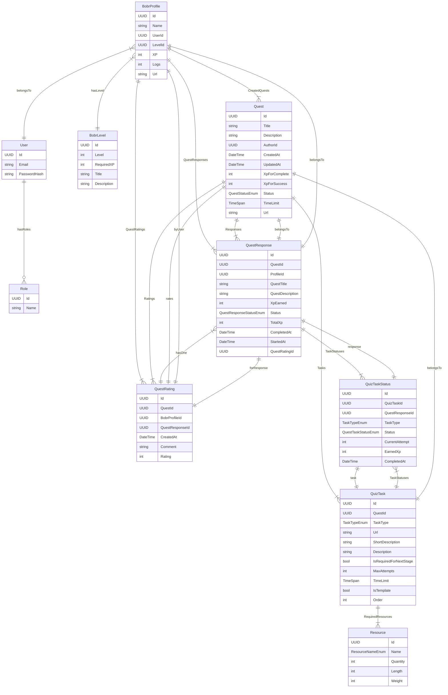

# INT20H | 2025 | BobrVerse

**This project is a test project for INT20H Hackaton. Read LICENSE for usage details.**

## Links:

- [BobrVerse Website](https://bobrverse.fun/)

**Technologies:**

Backend:

- Platform: .NET 8
- Network: RESTful
- Database: MS SQL Server/Entity Framework Core
- Cloud: Azure
- Authentication: OAuth/Basic
- Other: Redis Cache/Docker

Frontend:

- React/React-Redux
- HTML5/SCSS/TS

## DB Schema



## Start app on your local machine

### Setup environment

1. Make sure you have [Docker](https://www.docker.com).
2. Pull this repo to your machine.
3. Download and install [.NET 8 SDK](https://dotnet.microsoft.com/download).
4. Add user secrets to .Net project (watch 'Backend user secrets').
5. Go to frontend folder and create .env file (Not required if you run with docker).
6. Add environment variables to .env file (watch 'Table of frontend environment varibales') (Not required if you run with docker).

### Baсkend user secrets

1. Set BobrVerse.Api as active directory.
2. Run 
```sh
dotnet user-secrets init
```
 This will generate UserSecretsId in Api.csproj. Note that secrets.json has not been created yet.

3. Run 
```sh
dotnet user-secrets set {SecretName} {SecretValue}
```
 secrets.json will be created at %APPDATA%\Microsoft\UserSecrets\\{UserSecretsId}

4. Repeat previous stage to add all user secrets from table of backend user secrets

### Table of backend user secrets
| Secret Name                                 | Secret Value | Description |
|---------------|-----------|------------------------------|
| AzureBlobStorageSettings:ConnectionString  | (your_blob_connection_string) | Connection string for Azure Blob Storage. Replace with your actual credentials. |
| AzureBlobStorageSettings:BlobContainerName | files | Name of the blob container where files are stored. |
| AllowedOrigins                              | http://localhost:3001/ | Allowed origins for CORS configuration. |
| ConnectionStrings:BobrVerseDb               | (your_db_connection_string) | Connection string for the BobrVerse database. Replace with your actual database connection details. |
| Auth:Google:UserInfoUrl                     | https://www.googleapis.com/oauth2/v3/userinfo | URL for retrieving Google user info during authentication. |
| Auth:Redis:ConnectionString                 | (your_redis_connection_string) | Connection string for Redis cache. Replace with your actual Redis credentials. |
| Auth:Redis:DaysToExpire                     | 14 | Number of days before Redis entries expire. |
| Auth:Cookie:AccessTokenName                 | access_token | Name of the access token cookie. |
| Auth:Cookie:RefreshTokenName                | refresh_token | Name of the refresh token cookie. |
| Auth:Cookie:AccessTokenCookieMinutesExpire  | 30 | Expiration time for the access token in minutes. |
| Auth:Cookie:RefreshTokenCookieDaysExpire    | 14 | Expiration time for the refresh token in days. |
| Auth:Jwt:Secret                             | (your_jwt_secret) | Secret key for signing JWT tokens. Replace with a strong, secure secret. |
| Auth:Jwt:Issuer                             | your_issuer | Issuer of the JWT token. |
| Auth:Jwt:Audience                           | your_audience | Audience of the JWT token. |
| Auth:Jwt:TokenLifetimeMinutes               | 30 | Lifetime of JWT tokens in minutes. |
| Auth:RefreshToken:RefreshTokenLifeTimeInDays | 14 | Lifetime of refresh tokens in days. |
| Auth:RefreshToken:Secret                    | (your_refresh_token_secret) | Secret key for refresh tokens. Replace with a secure value. |

### Table of frontend environment variables

| Variable Name              | Variable Value                 | Description |
|----------------------------|--------------------------------|-------------|
| VITE_API_URL               | your-backend-url       | The base URL of the backend API. Replace with the actual API URL in production. |
| VITE_GOOGLE_CLIENT_ID      | your-google-client-id | The Google OAuth client ID used for authentication. |

### Build & Run with Docker (Backend)

1. Open a terminal in the root directory of backend project.
2. Build the Docker image:
   ```sh
   docker build -t bobrverse-api .
   ```
3. Run the container:
   ```sh
   docker run -d -p 8080:8080 --name bobrverse-api bobrverse-api
   ```
   - Change the port `8080` if necessary.

4. To check running containers:
   ```sh
   docker ps
   ```
5. To stop and remove the container:
   ```sh
   docker stop bobrverse-api && docker rm bobrverse-api
   ```

### Verifying backend Setup

Once running, you can check if the API is working by visiting:

```
http://localhost:8080/swagger
```

### Build & Run with Docker (Frontend)

1. Open a terminal in the root directory of the frontend project.
2. Build the Docker image:
   ```sh
   docker build . \
          --build-arg VITE_API_URL={VITE_API_URL} \
          --build-arg VITE_GOOGLE_CLIENT_ID={VITE_GOOGLE_CLIENT_ID} \
          -t bobrverse-frontend
   ```
   - Replace `{VITE_API_URL}` and `{VITE_GOOGLE_CLIENT_ID}` with actual values if running locally.

3. Run the container:
   ```sh
   docker run -d -p 3000:3000 --name bobrverse-frontend bobrverse-frontend
   ```
   - Change the port `3000` if necessary.

4. To check running containers:
   ```sh
   docker ps
   ```

5. To stop and remove the container:
   ```sh
   docker stop bobrverse-frontend && docker rm bobrverse-frontend
   ```

### Verifying frontend Setup

Once running, you can check if the frontend is working by visiting:

```
http://localhost:3000/
```
